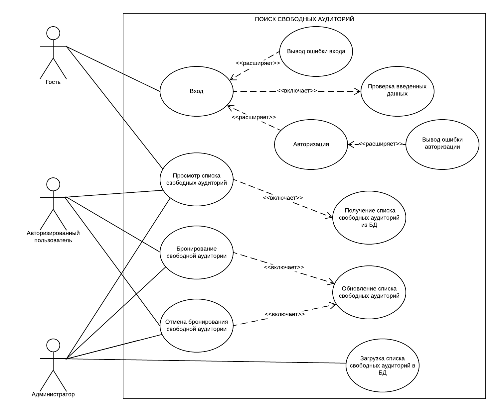
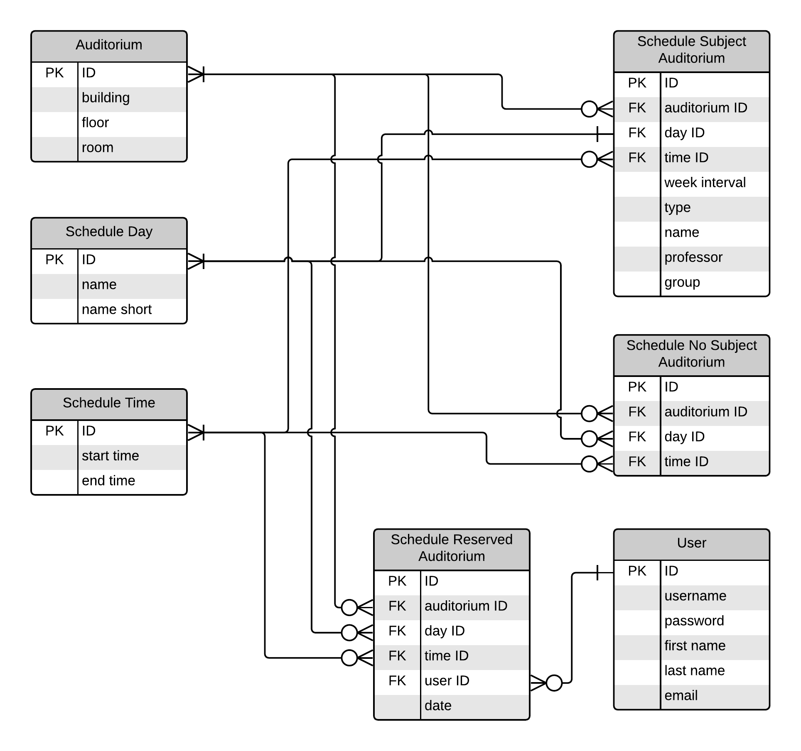
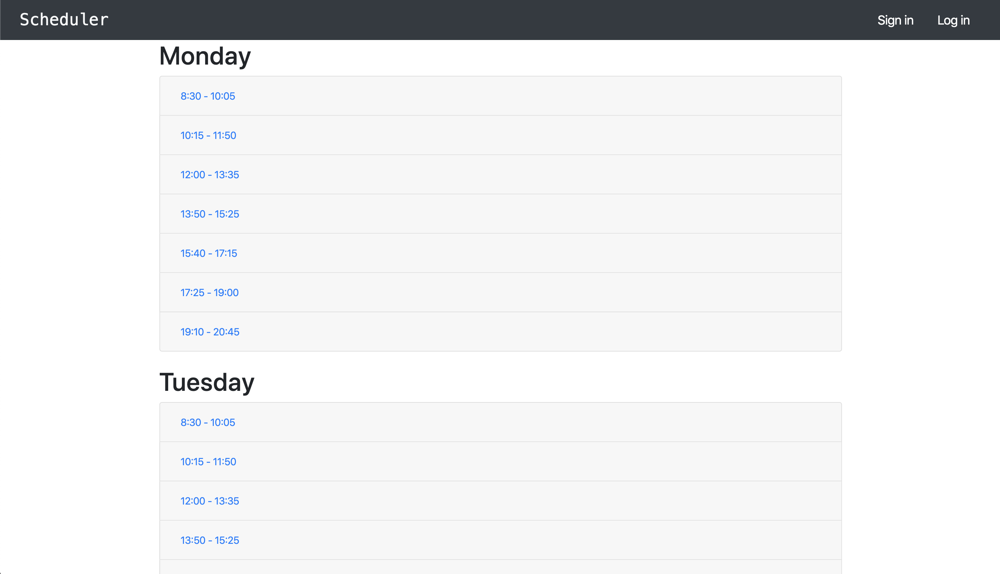
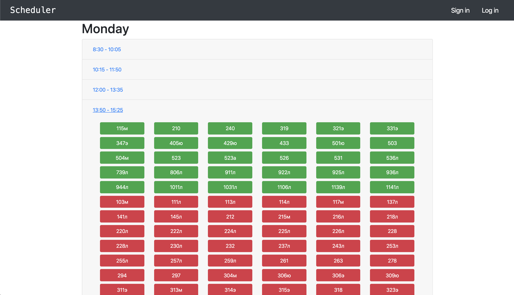
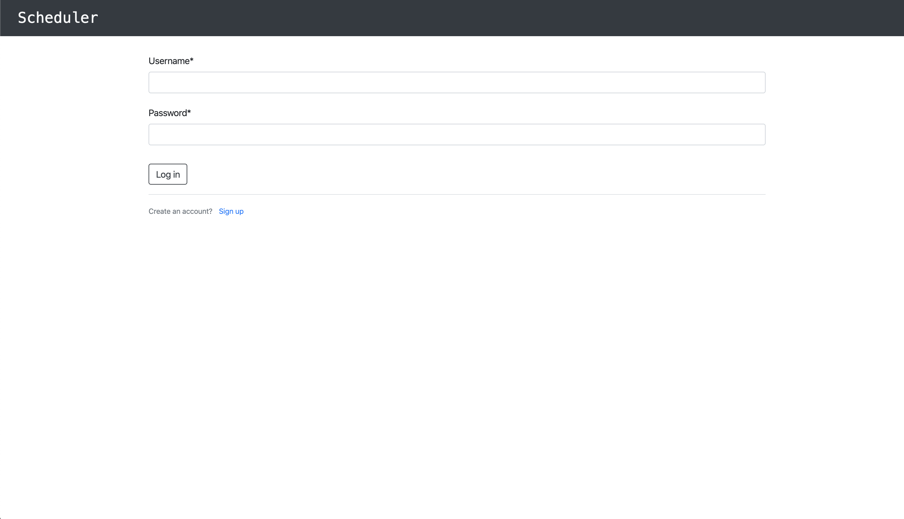
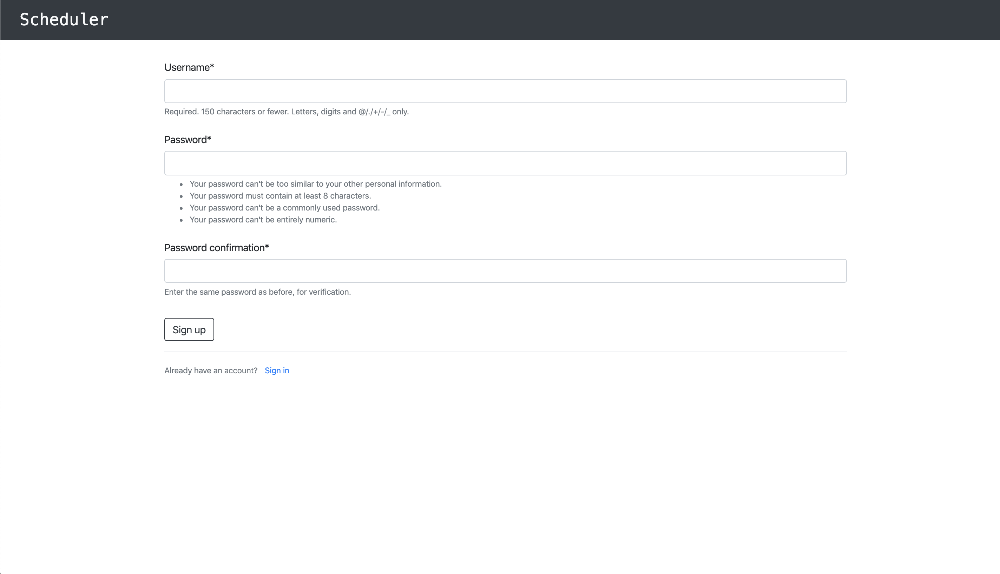
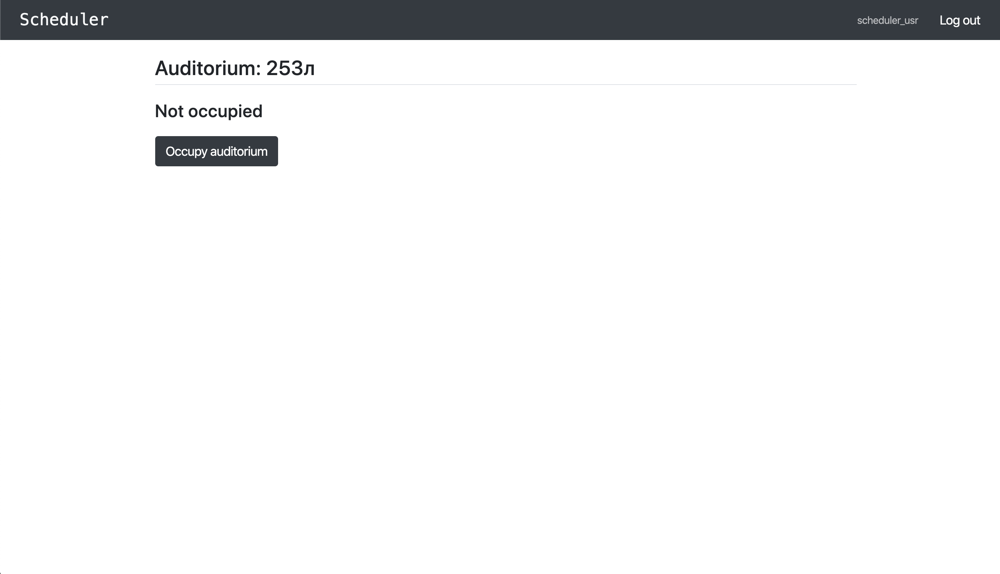
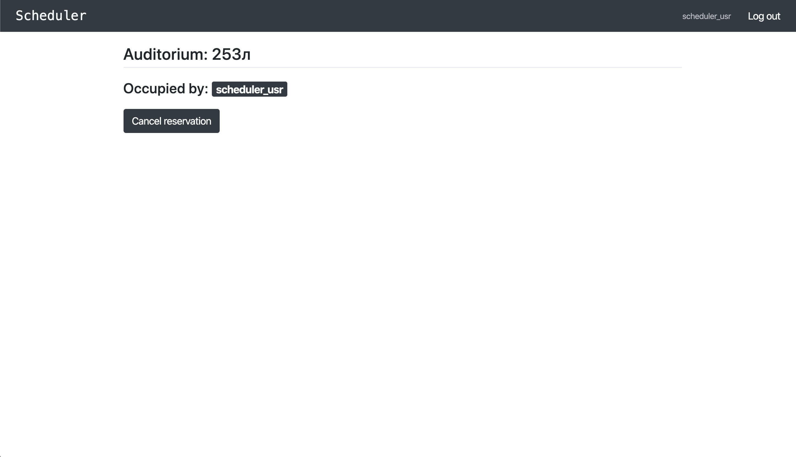
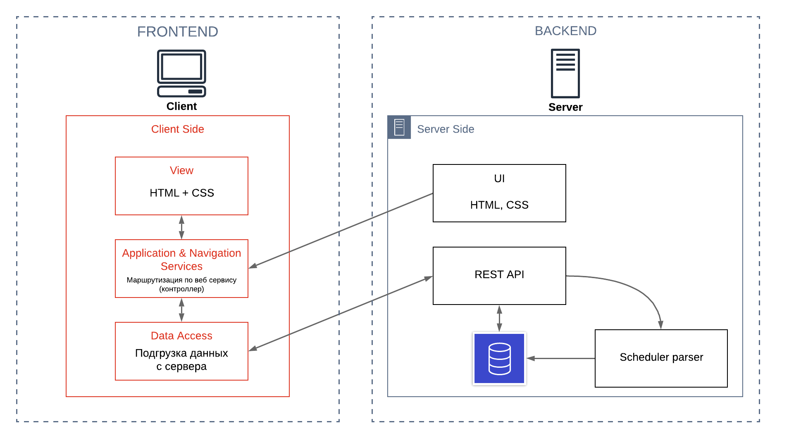

# Свободные аудитории

## Содержание

* [Введение](#введение)
* [Use-Case диаграмма](#use-case-диаграмма)
* [Сущности предметной области](#сущности-предметной-области)
* [Прототип интерфейса со всеми страницами](#прототип-интерфейса-со-всеми-страницами)
* [Архитектура приложения](#архитектура-приложения)
* [Технические детали реализации](#технические-детали-реализации)
* [CI](#ci)

## Введение

У большинства студентов часто бывают трудности при нахождении уединенного и тихого места для подготовки к лабораторным или семинарам. Одним из хороших примеров таких мест - пустые аудитории университета, в которых можно спокойно заняться работой. К сожалению, их приходится часто искать вручную, ходя по этажам в надежде, что где-то не будут проводиться занятия, либо же запоминать в какие дни и на каком этаже можно их найти. С этой целью и была придумана утилита по Поиску Свободных Аудиторий (в дальнейшем *ПСА*), предлагающее универсальное решение данной проблемы.

### Основные задачи утилиты ПСА:

- Возможность удобного просмотра свободных аудиторий:

    Для этого реализован специальный сайт с возможностью просмотра аудиторий в виде таблиц, с конкретным указанием времени и корпуса, в котором проводятся занятия;

- Простой интерфейс для резервирования аудиторий:

    В этот интерфейс входит возможность аутентификации на ресурсе и добавления аудитории в специальный список занятых;

## Use-Case диаграмма

В данной диаграмме есть три категории пользователей:

- Гость - неавторизованный пользователь, имеющий доступ к расписанию свободных аудиторий;
- Авторизированный пользователь - пользователь, имеющий учетную запись и доступ к сервису бронирования аудиторий(резервирование и отмена бронирования аудитории);
- Администратор - привилегированный пользователь, в возможности которого входит управление бронированиями других пользователей и состоянием базы данных;

## Сущности предметной области

Диаграмма классов:

#### **В работе будут использоваться следующие сущности:**

- Schedule Time

    Таблица с расписанием времен пар;

- Schedule Day

    Таблица дней;

- Auditorium

    Таблица аудиторий;

- Schedule Subject Auditorium

    Таблица занятых аудиторий по расписанию;

- Schedule Reserved Auditorium

    Таблица зарезервированных аудиторий;

- Schedule No Subject Auditorium

    Таблица свободных аудиторий;

- User

    Таблица зарегистрированных пользователей;

## Прототип интерфейса со всеми страницами

В пользовательском интерфейсе будут отображены все главные аспекты, которые нужны пользователю. На главной странице приложения будет отображаться страница:

**Главная страница:**

Главная страница сайта             |  С развернутым временем
:----------------------------|-------------------------------------:
|

**Страницы входа на сайт и регистрации:**

Вход             |  Регистрация
:----------------------------|-------------------------------------:
|

**Страница выбранной аудитории:**

Не занята             |  Занята
:----------------------------|-------------------------------------:
|

## Архитектура приложения

Для реализации данного приложения была выбрана архитектура **SPA(Single Page Application)**. Данная архитектура имеет следующие преимущества:

- Уменьшение количество запросов между клиентом и сервером;
- Маршрутизация проходит на стороне клиента;
- Возможность более комфортного использования данного приложения с плохим интернет подключением;
- Уменьшенный объем передаваемых данных;

**Структура взаимодействия Backend и Frontend сторон**

| Диаграмма взаимодействия |
|---|
||

**Описание взаимодействия API**

Обеспечивание входа на сайт(login):
- POST -> url/api/users/user_name

    body: {username, password}
    
    res: {data: {error: ""}}
    
Получение таблицы данных:
- GET -> url/api/table

    res: {data: {JSON object}, error: ""}
    
Регистрация нового пользователя:
- POST -> url/api/users

    body: {username, password}
    
    res: {data: {error: ""}}
    
Получение данных о аудитории по id:
- GET -> url/api/classes/class_id?day=""&time=""

    res: {data: {form: "occupied/not_occupied/occupied_by_user", username: "", subject: {name: "", type: ""}, groups: ["", "", ...], error: ""}}
    
Резервирование аудитории
- POST -> url/api/classes/class_id/reserve

    body: {username: '', time: '', day: ''}
    
    res: {data: {error: ""}}

Отмена резервирования аудиотории
- POST -> url/api/classes/class_id/unreserve

    body: {username: '', time: '', day: ''}
    
    res: {data: {error: ""}}

**Структура модулей/Классов**

Frontend классы : View, Model, Controller

Backend класс: App

## Технические детали реализации

**Frontend** - *Vue.js*

**Backend** - *django*

### Команда и состав

- Киселев Андрей @kam16u810

    Frontend, API

- Карсаков Максим @max_thyron

    Backend, DB

- Рыжкова Евгения @rek16u676

    HTML, CSS, Bootstrap, Тестирование

## CI

Выделены 4 последовательных стадии:

- build
- test
- release с сохранением артефактов
- publish

Для тестирования (**CI**) будет использоваться кафедральный GitLab.
